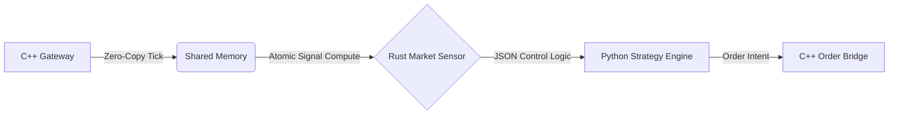
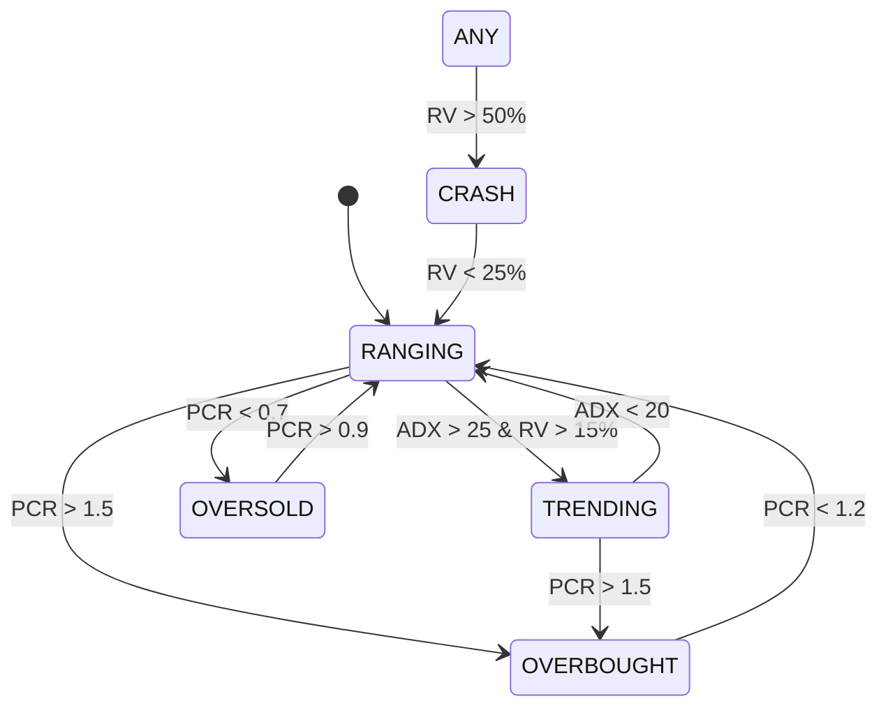
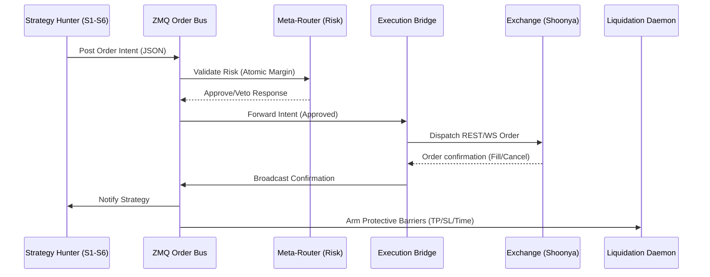

# Technical Specification: K.A.R.T.H.I.K.

## 1. The Optimized Fortress: Core Architecture
K.A.R.T.H.I.K. (**Kinetic Algorithmic Real-Time High-Intensity Knight**) is engineered as a distributed, low-latency fortress. In the aggressive landscape of options trading, speed is a baseline, but **Hardware Determinism** and **Fault-Tolerance** are the true differentiators.

### 🛡️ Engineering Philosophy
We treat the operating system as a source of "Jitter" (random delays). To achieve microsecond consistency, we use deep kernel-level optimizations to isolate our trading logic from OS overhead.

| Strategy | Implementation | The "Why" behind the Build |
| :--- | :--- | :--- |
| **CPU Pinning** | Core Isolation via taskset | Prevents the OS from "Context Switching." Keeps our code in the CPU's fast cache. |
| **HT Disabled** | Physical Core Mapping | Eliminates resource contention between virtual threads for consistent math. |
| **IRQ Isolation** | Network Interrupt Steering | Moves non-trading background noise (SSH, Logs) away from critical CPU cores. |
| **Memory Flow** | Transparent HugePages (THP) | Replaces 4KB blocks with 2MB blocks, accelerating HMM state inference. |
| **Zero-Lock IPC** | Shared Memory (SHM) | Data flows via zero-copy vectors. Threads never "wait" for each other. |

---

## 2. The Polyglot Pipeline: The High-Performance Stack
We use three distinct languages to optimize for the **Three Pillars of Trading**: Ingestion, Transformation, and Orchestration.

| Pillar | Language | Component | The "Why" behind the Choice |
| :--- | :--- | :--- | :--- |
| **Ingestion** | **C++** | `cpp_gateway` | **Zero-Latency Muscle**. Ingests data with zero memory fragmentation and SIMD-accelerated parsing. |
| **Transformation** | **Rust** | `tick_engine` | **Fearless Concurrency**. Computes 22+ signals in parallel without race-conditions using native FFI. |
| **Orchestration** | **Python** | `StrategyEngine` | **Rapid Evolution**. Updates complex rules and risk gates using `asyncio` and dynamic hot-swapping. |

---

## 3. Foundational Infrastructure: The Deterministic Backbone
This block represents the "Pipes" of K.A.R.T.H.I.K. that ensure data moves from the exchange to the strategy engines with sub-100 microsecond latency.

### 3.1 Tri-Brain C++ Ingestion (`cpp_gateway/`)
The ingestion layer is divided into three independent **Shards** (Alpha, Beta, Gamma) to provide hardware-level parallelism.

| Parameter | Specification | Technical Meaning |
| :--- | :--- | :--- |
| **SIMD Parser** | `simdjson::dom::parser` | Uses AVX2/NEON instructions; parses raw JSON in ~200ns per tick. |
| **Core Affinity** | Cores 1, 2, 3 | Each shard is physically pinned via `pthread_setaffinity_np` to eliminate L1 cache misses. |
| **Preemption Flush** | 30s SIGTERM window | Captures GCP Spot VM termination; flushes RAM to NVMe SSD in < 1s to prevent data loss. |
| **Memory Locality** | NUMA Core Allocation | Ensures threads execute on the physical core closest to their allocated memory segments. |

### 3.2 High-Precision Messaging Grid (`core/mq.py`)
All inter-service communication follows a 3-part multipart ZMQ pattern to maintain strict traceability.

**Message Anatomy:**
`[Topic (Index)] : [Header (JSON Metadata)] : [Data (Binary/JSON Payload)]`

| Mechanism | Implementation | Meaning |
| :--- | :--- | :--- |
| **Correlation ID** | `contextvars.ContextVar` | A unique UUID injected into the Header; traces a tick through Sensor, Strategy, and Bridge. |
| **Tracing Protocol** | Header Propagation | The Bridge logs the *same* UUID as the Sensor, enabling deterministic audit logs for specific trade events. |
| **Backpressure** | `RCVTIMEO = 5000` | Subscribers drop stale ticks if the engine falls behind, preventing "Queue Poisoning." |
| **Correlation mechanism** | `contextvars.ContextVar` | Unique UUIDs are injected into the ZMQ Header and restored on receipt for end-to-end tracing across daemons. |

### 3.3 Zero-Copy Shared Memory (`core/shared_memory.py` & `shm.py`)
Used for ultra-low latency data transfer between C++, Rust, and Python without serialization overhead.

**Byte-Level Structure (`32s d q d`):**
1. **Symbol**: 32-byte fixed-width string (Padded with `\0`).
2. **Price**: 8-byte double precision float.
3. **Volume**: 8-byte signed integer (64-bit).
4. **Timestamp**: 8-byte double (Unix epoch).

| Metric | Range | Meaning |
| :--- | :--- | :--- |
| **Slot Index** | $0 \dots 999$ | O(1) random access key for 1,000 top liquid tokens. |
| **Buffer Grid** | 1,000 Slots | Fixed-width memory matrix preventing heap allocation during market bursts. |
| **SHM Checksum** | CRC32 Sum | Prevents "Reader Tears" (reading data while it's being written). |
| **Heartbeat TTL** | $1.0\text{s}$ | If the SHM block is > 1s old, consumers assume the upstream feed has failed. |
| **Integrity Guard** | CRC32 Checksum | Built-in checksum validation prevents reading "torn" frames during concurrent writes. |

### 3.4 Distributed JSON Logger (`core/logger.py`)
Unified audit trail system optimized for ELK/Dashboard consumption.

| Feature | Implementation | Purpose |
| :--- | :--- | :--- |
| **JSON Schema** | `module, func, line, correl_id` | Standardized fields for high-speed indexing and cross-service grep. |
| **Rotation** | 10MB x 5 Files | Prevents disk exhaustion during "Vol-Spikes" while maintaining 50MB of history. |
| **Async Sink** | `StreamHandler` | Non-blocking stdout for Docker log aggregation. |
| **Audit Hygiene** | `hasHandlers()` check | Prevents duplicate logging entries during module re-imports in a shared environment. |

---

## 3.5 Resilience & Reliability Utilities (`core/`)
| Component | Implementation | System Purpose |
| :--- | :--- | :--- |
| **Alerting Bus** | Redis `LPUSH` | High-priority alerts are queued in `telegram_alerts` to avoid blocking tick processing. |
| **DB Self-Healing** | `_reconnect_pool()` | JIT asyncpg connection restoration via decorator-driven reconnection. |
| **Circuit Breaker** | OPEN/HALF_OPEN | State machine trips after 5 failures; prevents spamming stalled external API endpoints. |
| **Numerical Guard** | Epsilon Offsets | Greeks module uses small bias constants ($1e-9$) to maintain stability at $T=0$. |

---

## 4. Data Ingestion & Enrichment: The Fuel Logic
This block describes how the system retrieves raw exchange tokens and enriches them with macro context to guide the Alpha Hunters.

### 4.1 Hybrid Data Gateways (`daemons/data_gateway.py`)
Responsible for switching between live broker feeds and high-fidelity simulations.

| Parameter | Range / Logic | Meaning |
| :--- | :--- | :--- |
| **Simulated Ticks** | $10\text{Hz}$ (100ms) | Constant tick frequency during simulation mode to maintain "system rhythm." |
| **Staleness Watchdog** | $1000\text{ms}$ | If no tick arrives for a symbol in 1s, the gateway triggers a WebSocket FORCE_RESET. |
| **PCR Aggregate** | $300\text{s}$ (5 min) | Recalculates Put-Call Ratio across 20+ strikes to detect market sentiment shifts. |
| **Circuit Limit** | $10\% / 15\% / 20\%$ | SEBI-compliant halt matrix; broadcasts `SYSTEM_HALT` if hit. |
| **Batch Throttle** | 10s `copy_records` | Aggregates time-series writes to minimize NVMe IOPS and prevent DB bottlenecks. |

### 4.2 Dynamic Token Resolution (`utils/shoonya_master.py`)
Resolves human-readable strikes (e.g., NIFTY 22400 CE) to binary broker tokens on-the-fly.

| Logic Step | Implementation | Purpose |
| :--- | :--- | :--- |
| **Chunked Sync** | 10,000 items/batch | Populates Redis without causing I/O blocking for the live market feed. |
| **Binary Mapping** | `shoonya_nfo_tokens` | O(1) hash lookup from "Token" $\to$ "Symbol" for the C++ Gateway. |
| **Name Resolution** | `shoonya_nfo_symbols` | Resolves "Symbol" $\to$ "Token" for the Strategy Engine order routing. |
| **Initialization** | 10,000-chunk bulk | Populates Redis in managed batches to ensure zero I/O blocking on system boot. |

### 4.3 Macro Sentiment Scraper (`utils/fii_data_extractor.py`)
Analyzes institutional derivative positions to provide a global momentum vector.

| Metric | Range | Calculation Logic |
| :--- | :--- | :--- |
| **FII Bias Score** | $-15$ to $+15$ | $Bias = \text{Net\_Delta} / \text{Avg\_Notional\_Vol}$ (Normalized). |
| **Wait-for-Fetch** | 18:30 IST | Synchronized with NSE's daily EOD data release schedule. |
| **Session Handshake** | Homepage $\to$ API | Bypasses automated bot protection by maintaining authentic browser cookies. |
| **Enrichment Logic** | Institutional Scrape | Fetches FII net positioning to adjust Alpha confidence thresholds dynamically. |

### 4.4 Multi-Source Event Merging (`utils/macro_event_fetcher.py`)
Fuses global (US Fed) and domestic (RBI) economic events into a unified risk calendar.

| Tool | Source | Technical Purpose |
| :--- | :--- | :--- |
| **DNS Cache** | Local Resolver Overlay | Eliminates network lookup overhead during high-frequency API polling. |
| **IST Conversion** | `zoneinfo("Asia/Kolkata")` | Standardizes all global news timestamps for deterministic system freezes. |
| **Event Filter** | `Impact == "High"` | Only tracks events capable of causing structural volatility spikes. |
| **DNS Optimization** | Local Overlay Cache | Overrides Python DNS resolver to eliminate lookup latency during macro polling. |

---

## 3. The 22-Signal Matrix: The Quant Engine
K.A.R.T.H.I.K. translates raw market chaos into actionable math using a high-precision Signal Matrix.

| ID | Signal | Mathematical Formula | Calc Window | System Meaning |
| :--- | :--- | :--- | :--- | :--- |
| **S01** | **Log-OFI** | $Z = (x - \mu) / \sigma$ where $x = \ln(1+|B_{size}-A_{size}|) \cdot \text{sgn}(\Delta P)$ | 100 Ticks | **> +2.0**: Buy Pressure; **< -2.0**: Sell Pressure |
| **S02** | **VPIN** | $\sum |V_{buy} - V_{sell}| / V_{total}$ | 100 Unit Vol | **> 0.8**: High Toxicity; **< 0.2**: Low Liquidity |
| **S03** | **Hurst (H)** | $\ln(R/S) = H \ln(n) + k$ (Rescaled Range) | 500 Ticks | **> 0.5**: Trending; **< 0.5**: Mean-Reverting |
| **S04** | **GEX Sign** | $\sum (\Gamma_i \cdot \text{sgn}(S - K_i))$ | All Strikes | **POS**: Sticky Vol; **NEG**: Squeeze Risk |
| **S05** | **Vanna** | $\partial \Delta / \partial \sigma \approx \Gamma \cdot (S/\sigma) \cdot 0.01$ | Near-Term | Sensitivity of Delta to Volatility jumps. |
| **S06** | **Charm** | $\partial \Delta / \partial t \approx \Theta \cdot 0.1$ | < 2 DTE | Delta decay as time passes toward expiry. |
| **S07** | **Dispersion** | Avg Pearson Correlation $(\rho)$ of Top 10 | 3-Min Row | **> 0.7**: Systemic Move; **< 0.3**: Local Noise |
| **S08** | **CVD Absorp** | $\text{Price}_{LL} \land \text{CVD}_{HL}$ | 10 Tick | Hidden limit-order walls absorbing market flow. |
| **S09** | **Basis Z** | $(F - S - \mu) / \sigma$ | 500 Ticks | Future-Spot dislocation; Arbing trigger. |
| **S10** | **Spot Z** | $(S - \mu_{15m}) / \sigma_{15m}$ | 900 Ticks | Extreme mean reversion (Elastic Bounce). |
| **S11** | **ATR** | Exponential Moving Average of True Range | 20 Ticks | **The Volatility Unit** for position sizing. |
| **S12** | **Kaufman ER** | $|P_t - P_{t-n}| / \sum |P_i - P_{i-1}|$ | 10 Ticks | Efficiency Ratio; filters out "choopy" noise. |
| **S13** | **ADX** | DX smoothed via Wilders Moving Avg | 14 Window | **> 25**: Strong Trend; **< 20**: Range/Weak. |
| **S14** | **Sent. Bias** | News Sentiment $\in [-1.0, 1.0]$ | Live feed | Multiplier for Composite Alpha score. |
| **S15** | **Regime** | HMM Viterbi Max Probability State | 1000 Ticks | **The Navigator**: Selector for S1-S6 mode. |
| **S16** | **Vol Ratio** | $IV_{\text{near}} / IV_{\text{far}}$ | JIT Fetch | Inversion predicts imminent vol explosion. |
| **S17** | **ZGL** | Volume-Weighted Mean Node (ZGL) | 100 Ticks | The pivot level where Dealer Hedging flips. |
| **S18** | **Toxic Opt** | $Charm < -0.05$ | Real-Time | Categorizes option as "Gamma-Dangerous." |
| **S19** | **Flip Ticks** | $\text{count}(\text{sgn}(CVD)_t \neq \text{sgn}(CVD)_{t-1})$ | 10 Ticks | Measures order-flow indecision. |
| **S20** | **Dislocation** | $|Basis\_Z| > 3.0$ | Real-Time | Binary trigger for Basis Reversion trades. |
| **S21** | **Alpha (A)** | $\sum (\text{weight}_i \cdot \text{Signal}_i)$ | 1 tick | Continuous score [-100, 100] for confidence. |
| **S22** | **FII Bias** | Normalized Institutional Net Buy/Sell | Overnight | The "Big Money" momentum vector. |

---

## 4. Regime Inference Engine: The Mathematical Navigator
The HMM (Hidden Markov Model) classifies market states by treating price action as an observable outcome of a hidden "market mood."

### 🧬 HMM State Transition Diagram

| Regime State | Transition Thresholds | Target Strategy |
| :--- | :--- | :--- |
| **TRENDING** | $ADX > 25$ AND $RV > 0.15$ | S1 (Gamma Momentum) |
| **RANGING** | $ADX < 20$ OR $RV < 0.15$ | S2 (Fade) / S6 (Condor) |
| **OVERBOUGHT** | $PCR > 1.5$ | S2 (High-Strike Bias) |
| **OVERSOLD** | $PCR < 0.7$ | S2 (Low-Strike Bias) |
| **CRASH** | $RV > 0.50$ | **VETO** (Stop New Trades) |

---

## 5. Order Lifecycle: The Execution Path
From the moment a "Hunter" identifies a setup, the order traverses a distributed, 4-layer verification path to ensure technical integrity and risk alignment:

1. **Alpha Validation (The Filter)**: Every signal must clear a composite hurdle of $\text{Alpha} > 40$, $\text{Sentiment} > -0.3$, and $\text{log-OFI Z-Score} > 2.0$.
2. **Contextual Veto (The Gatekeeper)**: Meta-Router performs a **Cross-Index Divergence** check ($\rho < 0.40$) and verifies the HMM regime is not `CRASH` ($RV > 50\%$).
3. **Atomic Allocation (The Banker)**: Uses `LUA_RESERVE` to lock strategy-specific capital. Sizing is calculated as $\text{Lots} = (\text{Account\_Heat} \times \text{Kelly\_Fraction}) / \text{ATR\_Risk}$.
4. **Resilient Dispatch (The Bridge)**: Order intents are journaled to Redis `Pending_Journal` before being handed to the `TokenBucket` for 8 req/sec capped dispatch.

### 5.0 Core Execution Logic
| Logic Component | Parameter / Calculation | Range / Limit |
| :--- | :--- | :--- |
| **Adaptive Chaser** | Attempts: 5 Loops | $\text{Ticks} = \text{Initial} \pm (n \times 0.05)$ | Stop if loop $> 5$ |
| **Slippage Cap** | Max Allowed Slippage | $0.10\%$ of Asset Price | Breaches trigger `SlippageCapBreached` |
| **Wait-for-Fill** | Execution Timeout | $3,000\text{ms}$ (3 seconds) | Triggers `trigger_rollback()` if partial |
| **Leg Sequencing** | BUY-before-SELL | Sequential Flag == `True` | Optimizes margin-offset utilized per basket |

### 5.1 Execution Guardrails
| Guard | Implementation | Meaning |
| :--- | :--- | :--- |
| **Rate Limit** | `TokenBucket` | Enforces 8 requests/second to prevent broker-side API suspension. |
| **Integrity Watchdog**| 3s Basket Timeout | Reconciler kills/rolls back any multi-leg basket that hasn't filled within 3 seconds. |
| **Origination Trace**| `BASKET_ORIGINATION` | Handshake message sent by the Execution Wrapper to link disparate legs under a single intent UUID. |
| **Margin Sequence** | BUY before SELL | Execution Wrapper sorts legs to ensure long positions are opened first, optimizing margin utilization. |

---

## 6. Macro Intelligence & Ingestion Grid
1. **Source**: Fetches High-Impact events from **ForexFactory** and **FMP API**.
2. **Normalization**: All times converted to **IST (Asia/Kolkata)**.
3. **Veto Logic**: Automatic block on new entries 15 minutes prior to Tier-1 events.
4. **Cloud Discovery**: Registry of `vm_public_ip` in Firestore allows dashboard connection to dynamic GCP Spot instances.

---

## 7. The Strategy Execution Matrix: The Hunters
| ID | Name | Core Signal Math | Loop Window | Orphan Condition |
| :--- | :--- | :--- | :--- | :--- |
| **S1** | **Gamma Mom.** | Spot Breakout + Neg GEX | Every Tick | Regime Shift (Trend $\to$ Range) |
| **S2** | **The Fade** | Spot Z-Score > $|2.5|$ + CVD Abs. | Every Tick | Spread Expansion > $300\%$ |
| **S3** | **VWAP Grav.** | Anchored VWAP + SMA Cross | 1-Min Candle | 1-Min Close on wrong side |
| **S3 Optimization** | Polars Engine | Uses high-performance vectorization for VWAP; re-anchors at 09:30 AM for gap normalization. |
| **S4** | **OI Pulse** | OI Accel > $300\%$ vs Mean | Real-Time | Spot > OI Wall for > 30s |
| **S5** | **Lead-Lag** | Ratio Z > $|2.5|$ + $\rho < 0.40$ | 1-Min Rolling | Correlation Snapback > 0.80 |
| **S6** | **Iron Condor** | 15-Iter Binary Delta Search | 5-Minute | Expiry / Regime Shift |

---

## 8. Structural Safety & Atomic Controls
- **LUA_RESERVE**: Atomic margin check preventing "Double-Spending" of capital.
- **LUA_RELEASE**: Atomic credit system that returns margin to the pool upon position liquidation.
- **Cross-Index Veto**: Meta-Router blocks entries if major indices (NIFTY/BANKNIFTY) exhibit > 2.0% divergence, indicating a "Regime Fracture."
- **Slippage Halt**: 60s pause if market spread > 3x rolling baseline.
- **JIT Latency Priming**: Strategy Engine fires 1,000 synthetic ticks at startup (`warmup_engine`) to trigger Python Bytecode optimization.

---

## 9. Capital Allocation & Risk: The Governor
### 📈 Hybrid Sizing Formula
1. **ATR Unit**: $UnitSize = \text{MAX\_RISK\_PER\_TRADE} / (\text{ATR} \cdot \text{ATR\_SL\_MULTIPLIER})$
2. **Kelly Multiplier**: $\text{FinalLots} = \text{UnitSize} \cdot \max(0.01, 0.5 \cdot \text{Kelly}_f)$

---

## 10. The Final Shield: Liquidation Protocols
| Barrier | Calculation Logic | System Action |
| :--- | :--- | :--- |
| **TP1** | $Price \ge \text{Entry} + (1.2 \cdot \text{ATR})$ | **Partial Exit** ($70\%$). |
| **SL** | $Price \le \text{Entry} - (1.0 \cdot \text{ATR})$ | **Full Liquidation**. |
| **Stall** | $Elapsed \ge 300\text{s} \cdot \Theta_{\text{scale}}$ | **Stagnation Exit**. |

---

## 11. Cloud Infrastructure & Messaging Grid
- **ZeroMQ Messaging**: Pub/Sub grid for millisecond strategy coordination.
- **Tiny Recorder**: LZMA-compressed binary tick archival.

---

## 12. Docker Isolation: The 14-Container Heartbeat
- **Strategic Isolation**: Every strategy hunter runs in its own container.
- **Hot-Swapping**: Update a single strategy without stopping the main data feed.

---

## 13. Deterministic Regime Bootstrapping
| Phase | Logic | Purpose |
| :--- | :--- | :--- |
| **History Hydration** | 14D TimescaleDB Sync | `SystemController` hydrates Redis with the last 14 sessions of OHLC data at boot. |
| **Deterministic Rules** | Threshold-based Matrix | Replaces stochastic transitions with hard limits ($RV < 15\%, ADX < 25$) for O(1) inference. |
| **Parameter Sync** | 300-Tick Refresh | Periodic sync of PCR and Volatility metrics ensure the heuristic engine does not drift mid-session. |

> [!NOTE]
> **Legacy/Shadow Code**: The files `utils/hmm_trainer.py` and `utils/hmm_cold_start.py` (and references to log-likelihood/promotion) are retained for offline research purposes only. They are **NOT** part of the active production execution pipeline in the Heuristic Era.

---

---

*End of Technical Specification. Engineered for Performance. Built for Survival.*
